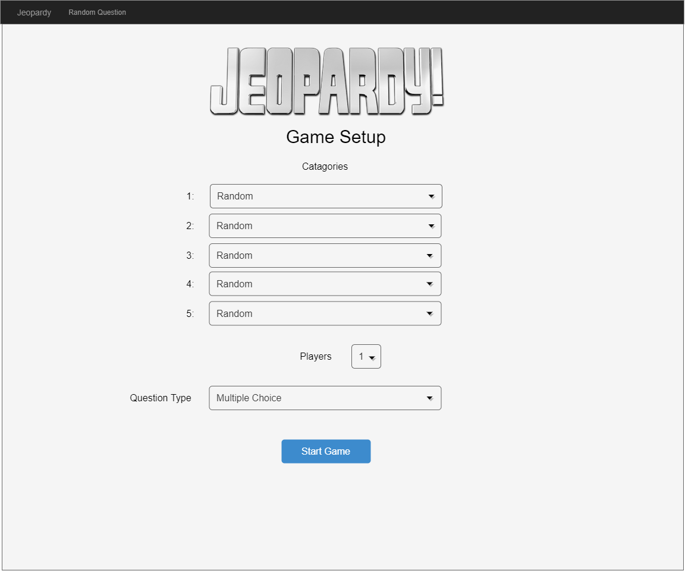
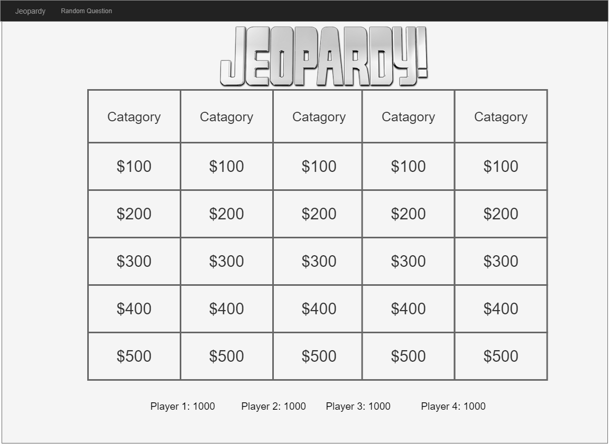
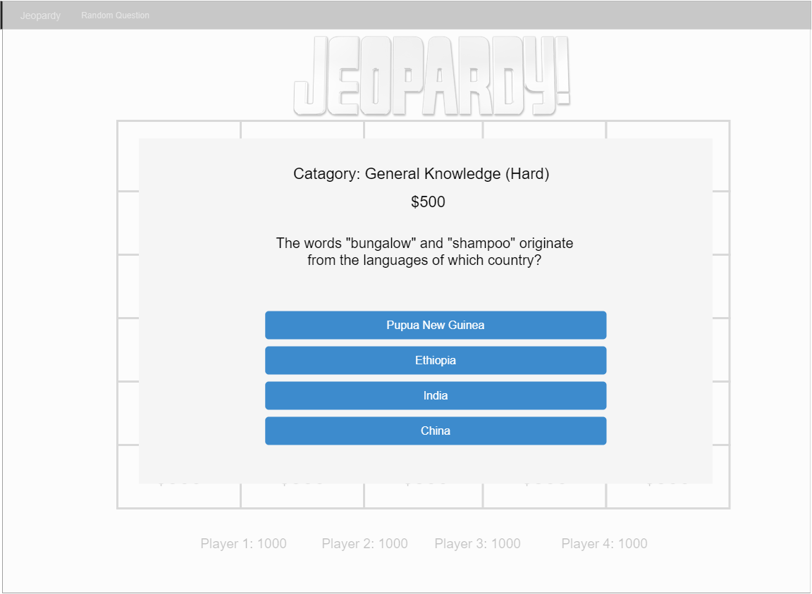

# Final Project Idea - Jeopardy
### API Used - [https://opentdb.com](https://opentdb.com)

This is a basic version of the game Jeopardy using trivia questions retrieved from the Open Trivia API.

To begin a game you will need to go though the set up screen

There is the option to:
* Choose what you would like for the categories (You cannot have the same category twice).
* Enter how many players will be playing (1-4).
* Choose what type of questions you would like (multiple choice, true/false, or both).

Click "Start Game" to move forward to the Game Screen

Here you have a basic Jeopardy game board with each players current score down at the bottom. The API's easy difficulty questions go behind the $100 and $200 questions, medium behind $300 and $400, and hard goes behind the $500 box.

Question boxes are scored $100-$500 and will be grayed out as those questions are answered. The current player choosing will be indicated just above the game board.

When a question has been clicked on a popup will appear with the question

You will be shown the category, difficulty, prize, and question. If the question is a true/false question then you will only have two options to choose from, if it is multiple choice then there will always be four. Multiple choice questions will also have their order randomized.

If the question failed to be answered correctly then it will return to the game board and the failed question will have a red **Attempted** underneath the value, allowing the next player to try it or choose a different question.

### Bonus
There is also the option on the header bar to play one random question from a random category, this page will look very similar to the question screen from the main game.